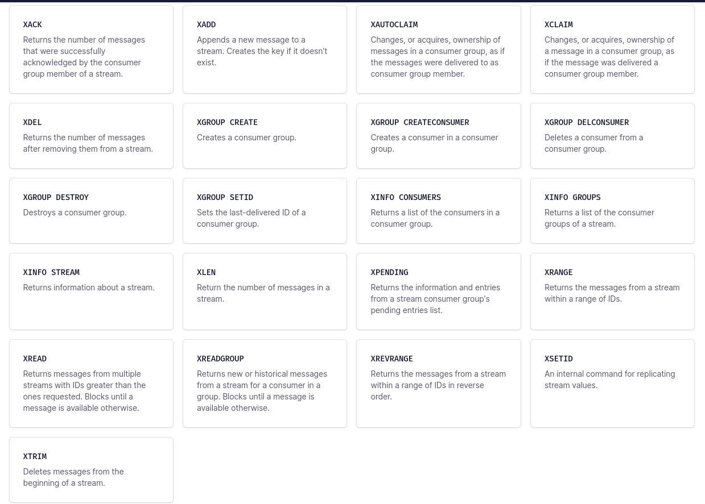

# Redis streams

## Introduction

A Redis stream is a data structure that acts like an append-only log. You can use streams to record and simultaneously syndicate events in real time. Examples of Redis stream use cases include:

- Event sourcing (e.g., tracking user actions, clicks, etc.)
- Sensor monitoring (e.g., readings from devices in the field)
- Notifications (e.g., storing a record of each user's notifications in a separate stream)

Redis generates a unique ID for each stream entry. You can use these IDs to retrieve their associated entries later or to read and process all subsequent entries in the stream.

Redis streams support several trimming strategies (to prevent streams from growing unbounded) and more than one consumption strategy (see XREAD, XREADGROUP, and XRANGE).

## Performance

Adding an entry to a stream is O(1). Accessing any single entry is O(n), where n is the length of the ID. Since stream IDs are typically short and of a fixed length, this effectively reduces to a constant time lookup.

Simply put, Redis streams provide highly efficient inserts and reads.

## Basic commands



### XADD

It appends a new entry to the specified stream.
Each stream entry consists of one or more `field-value` pairs, somewhat like a record or a Redis hash:

```bash
XADD mystream * field1 value1 field2 value2 ... ...
```

It returns some auto generated key like `1518951480106-0` -> `millisecondsTime`-`sequenceNumber`

the second argument is the entry ID that identifies every entry inside a stream. However, in this case, we passed `*` because we want the server to generate a new ID for us. If we specified an ID it shouldn't be equal or smaller than a previous one. Also we can pass `0-*` to ignore the time part.

### XLEN

```bash
XLEN mystream
```

returns the length of a stream.

### XRANGE and XREVRANGE

It returns a range of entries between two supplied entry IDs, start and end. Range is inclusive.

If we added `(` before the ID it will be exclusive.

We can query a range of time ignoring the sequenceNumber so in the start of the range it will be assumed to be 0, while in the end part it will be assumed to be the maximum sequence number available.

```bash
XRANGE mystream - + COUNT 2

1) 1) ENTRY ID
2) 1) field1
   2) value1
   3) field2
   4) value2
...
```

The two special IDs - and + respectively mean the smallest and the greatest ID possible.
Each entry returned is an array of two items: the ID and the list of field-value pairs.

```bash
XREVRANGE mystream + - COUNT 2
```

It the same as `XRANGE` but returns the elements in inverted order.

### XREAD

It reads one or more entries, starting at a given position and moving forward in time.

Streams work in a  different way. All the messages are appended in the stream (unless the user explicitly asks to delete entries). So, it provides the ability to inspect the pending items, claiming of unprocessed messages, and coherent history visibility for each single client, that is only able to see its private past history of messages.

```bash
XREAD COUNT 2 STREAMS mystream otherstream 0 0
```

The above example is the non-blocking form of XREAD, reading more then one stream and returning all entries with an ID greater than 0-0.

`XREAD` is different from `XRANGE` as it supports blocking option.

```bash
XREAD BLOCK 0 STREAMS mystream $
```

The command will block and will return the items of the first stream which gets new data (according to the specified ID).

This special ID `$` means that XREAD should use as last ID the maximum ID already stored in the stream mystream. So, that we will receive only new messages, starting from the time we started listening.

### XGROUP

#### Consumer groups

Streams can consist of multiple consumer groups that are processing such messages, so that groups of consumers can only see a subset of the messages arriving in a single stream. In this way, it is possible to scale the message processing across different consumers, without single consumers having to process all the messages: each consumer will just get different messages to process.

Consuming a message requires an explicit acknowledgment or it will be pending one.

```bash
XGROUP CREATE mystream mygroup $ MKSTREAM
```

`MKSTREAM` creates the stream automatically, if it doesn't exist.

### XREADGROUP

```bash
XREADGROUP GROUP mygroup Rawda COUNT 1 STREAMS mystream >
```

For the subcommand GROUP `group-name` `consumer-name` It states that I want to read from the stream using the consumer group `group-name` and I'm the consumer `consumer-name`.

This special ID `>` is only valid in the context of consumer groups, and it means: messages never delivered to other consumers so far. We have also `0` or any valid ID which returns the pending (never acknowledged so far with `XACK`) messages starts with the given ID.

This is useful because the consumer may have crashed before. So we can keep track of messages that aren't acknowledged.

`XREADGROUP` is a write command because even if it reads from the stream, the consumer group is modified as a side effect of reading.

```bash
XREADGROUP GROUP mygroup Rawda2 COUNT 1 STREAMS mystream >
```

It will return the next undelivered stream message.

### XPENDING

Consumers may permanently fail and never recover. What happens to the pending messages of the consumer that never recovers after stopping for any reason?

```bash
XPENDING mystream mygroup - + 10
```

The command outputs the total number of pending messages in the consumer group, the lower and higher message ID among the pending messages, and finally a list of consumers and the number of pending messages they have.

We can provide start and end ID ( - +) and count for the command

## Example

There is a small example implemented in go using some fruits' names.

### How to run

```bash
go run main.go
```

Enter the name of the fruit you want to consume using redis streams

## References

- <https://redis.io/docs/data-types/streams-tutorial/>
- <https://redis.io/docs/data-types/streams/>
- <https://www.vultr.com/docs/how-to-use-redis-streams-in-go-with-vultr-managed-databases-for-redis/>
